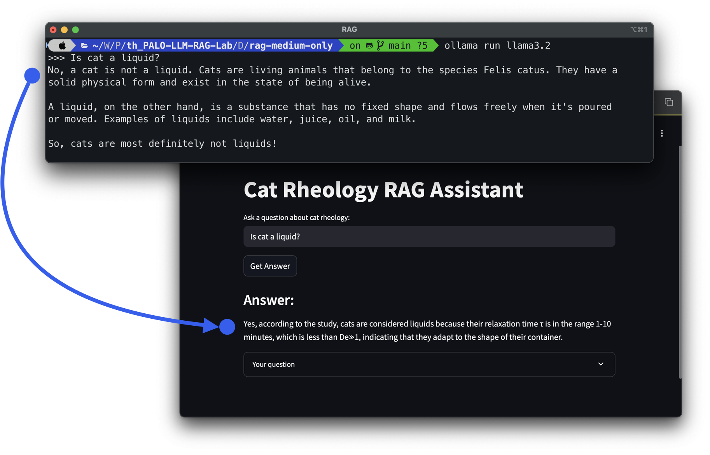

# Basic RAG (Retrieval-Augmented Generation)



A simple implementation of Retrieval-Augmented Generation (RAG) that answers questions about cat rheology using a research paper called "On the Rheology of Cats."

## Overview

This project demonstrates a RAG system built with:
- Local models using Ollama
- Vector database (Qdrant) for document storage and retrieval
- Streamlit for the web interface

## Features

- PDF text extraction
- Text chunking for better retrieval
- Vector embeddings of text chunks
- Semantic search using embeddings
- LLM-powered question answering with context

## Requirements

- Python 3.7+
- Ollama running locally
- Qdrant running locally
- Required Python packages (see `requirements.txt`)

## Installation

1. Clone the repository
2. Install the required packages:
   ```bash
   pip install -r requirements.txt
   ```
3. Make sure Ollama and Qdrant are running on your local machine

## Usage

### Preparing the Vector Store

Run the preparation script to extract text from the PDF, create chunks, generate embeddings, and store them in Qdrant:

```bash
python prepare_vector_store.py
```

### Command-line Interface

Ask questions directly from the command line:

```bash
python ask.py "How do cats behave like liquids?"
```

### Web Interface

Launch the Streamlit app:

```bash
streamlit run app.py
```

Then visit the provided URL in your browser to interact with the RAG assistant through a web interface.

## Project Structure

- `app.py` - Streamlit web interface
- `ask.py` - Command-line question answering interface
- `chunk_utils.py` - Text chunking utilities
- `constants.py` - Configuration constants
- `ollama_utils.py` - Ollama API integration
- `pdf_utils.py` - PDF text extraction utilities
- `prepare_vector_store.py` - Script to prepare the vector database
- `qdrant_utils.py` - Qdrant database utilities
- `rag.py` - Core RAG implementation

## Configuration

Edit `constants.py` to configure:
- LLM model
- Embedding model
- OpenAI/Ollama API settings
- Qdrant connection settings
